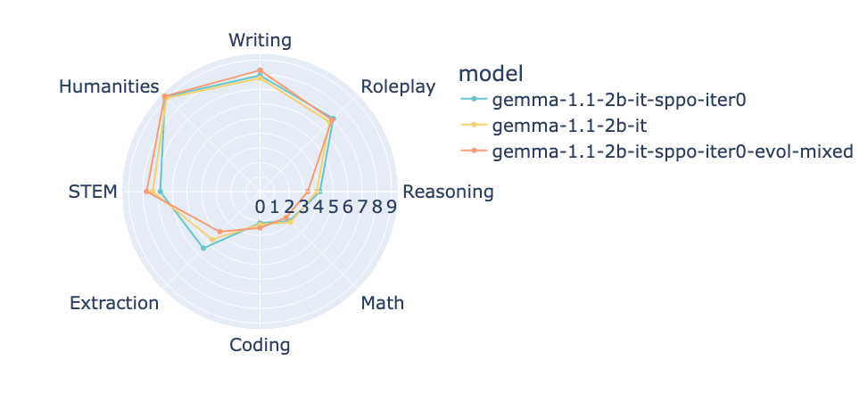

# MT-Bench

<div style="text-align: center;">
    
</div>


This folder is adapted from FastChat's [LLM Judge](https://github.com/lm-sys/FastChat/tree/main/fastchat/llm_judge).


MT-bench is a set of challenging multi-turn open-ended questions for evaluating chat assistants, with the following categories:
```
CATEGORIES = ["Writing", "Roleplay", "Reasoning", "Math", "Coding", "Extraction", "STEM", "Humanities"]
```


## Requirements
```bash
git clone https://github.com/lm-sys/FastChat.git
cd FastChat
pip install -e ".[model_worker,llm_judge]"
pip install openai==1.28.0
```


## Example Usage
```bash
# 0. Define the model paths and IDs in arrays
MODEL_PATHS=(
    "cat-searcher/gemma-2-9b-it-sppo-iter-0"
    "cat-searcher/gemma-2-9b-it-sppo-iter-1"
    "cat-searcher/gemma-2-9b-it-sppo-iter-2"
    "cat-searcher/gemma-2-9b-it-sppo-iter-3"
    "cat-searcher/gemma-2-9b-it-sppo-iter-4"
    "cat-searcher/gemma-2-9b-it-sppo-iter-5"
)

MODEL_IDS=(
    "gemma-2-9b-it-sppo-iter-0"
    "gemma-2-9b-it-sppo-iter-1"
    "gemma-2-9b-it-sppo-iter-2"
    "gemma-2-9b-it-sppo-iter-3"
    "gemma-2-9b-it-sppo-iter-4"
    "cat-searcher/gemma-2-9b-it-sppo-iter-5"
)


# 1. Download models
for i in "${!MODEL_PATHS[@]}"; do
    python download_model.py \
        --model-path "${MODEL_PATHS[$i]}"
done

# 2. Generate answers 
for i in "${!MODEL_PATHS[@]}"; do
    python gen_model_answer.py \
        --model-path "${MODEL_PATHS[$i]}" \
        --model-id "${MODEL_IDS[$i]}" \
        --num-gpus-total 8
done

# 3. Generate judgements 
python gen_judgment_single.py \
    --model-list "${MODEL_IDS[@]}" \
    --parallel 40 

# 4. Show results
python show_result.py \
    --model-list "${MODEL_IDS[@]}" \
    --filename-suffix _combined
```
Checkout plots in `plot_result.py`.

To add new models and get updated results:
```bash
_MODEL="cat-searcher/gemma-2-9b-it-sppo-iter-6"
_MODEL_ID="gemma-2-9b-it-sppo-iter-6"

MODEL_PATHS+=($_MODEL)
MODEL_IDS+=($_MODEL_ID)

# 1. Download the model if it is not already in HF cache
python download_model.py \
    --model-path $_MODEL

# 2. Generate answers
python gen_model_answer.py \
    --model-path $_MODEL \
    --model-id $_MODEL_ID \
    --num-gpus-total 8

# 3. Generate judgement
python gen_judgment_single.py \
    --model-list "${MODEL_IDS[@]}" \
    --parallel 40 \
    --filename-suffix _latest  # Use any suffix to differentiate

# 4. Show result
python show_result.py \
    --model-list "${MODEL_IDS[@]}" \
    --filename-suffix _combined_latest
```

We have modifed the original MT-Bench file so that you would not waste API calls on previously judged models.
