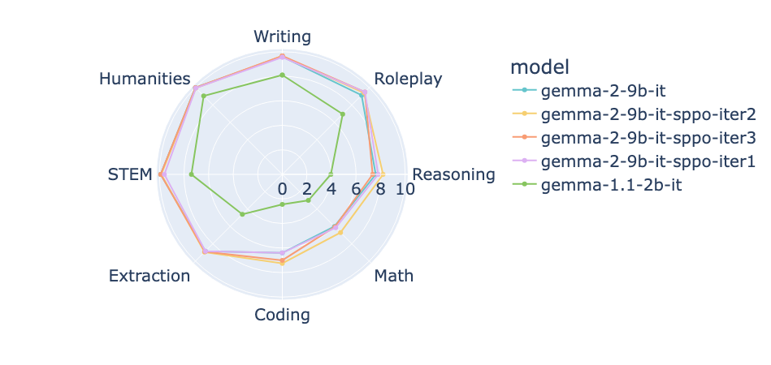

# MT-Bench

<div style="text-align: center;">
    
</div>


This folder is adapted from FastChat's [LLM Judge](https://github.com/lm-sys/FastChat/tree/main/fastchat/llm_judge).


MT-bench is a set of challenging multi-turn open-ended questions for evaluating chat assistants, with the following categories:
```
CATEGORIES = ["Writing", "Roleplay", "Reasoning", "Math", "Coding", "Extraction", "STEM", "Humanities"]
```


## Requirements
```bash
git clone https://github.com/lm-sys/FastChat.git
cd FastChat
pip install -e ".[model_worker,llm_judge]"
```


## Example Usage
```bash
# 0. Define the model paths and IDs in arrays
MODEL_PATHS=(
    "google/gemma-1.1-2b-it"
    "google/gemma-2-9b-it"
)

MODEL_IDS=(
    "gemma-1.1-2b-it"
    "gemma-2-9b-it"
)

# 1. Download models
for i in "${!MODEL_PATHS[@]}"; do
    python download_model.py \
        --model-path "${MODEL_PATHS[$i]}"
done

# 2. Generate answers 
for i in "${!MODEL_PATHS[@]}"; do
    python gen_model_answer.py \
        --model-path "${MODEL_PATHS[$i]}" \
        --model-id "${MODEL_IDS[$i]}" \
        --num-gpus-total 4
done

# 3. Generate judgements 
python gen_judgment.py \
    --model-list "${MODEL_IDS[@]}" \
    --parallel 40

# 4. Show results
python show_result.py \
    --model-list "${MODEL_IDS[@]}"
```
Checkout plots in `plot_result.py`.


